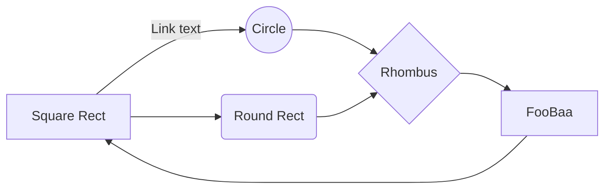
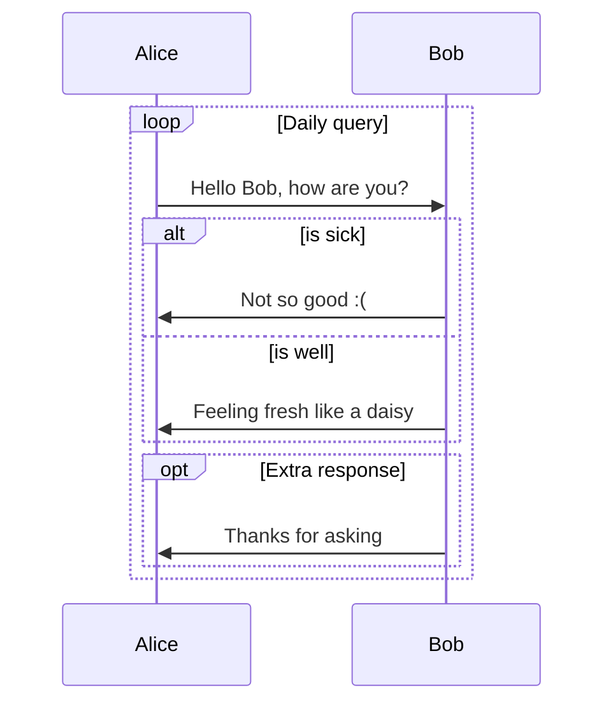
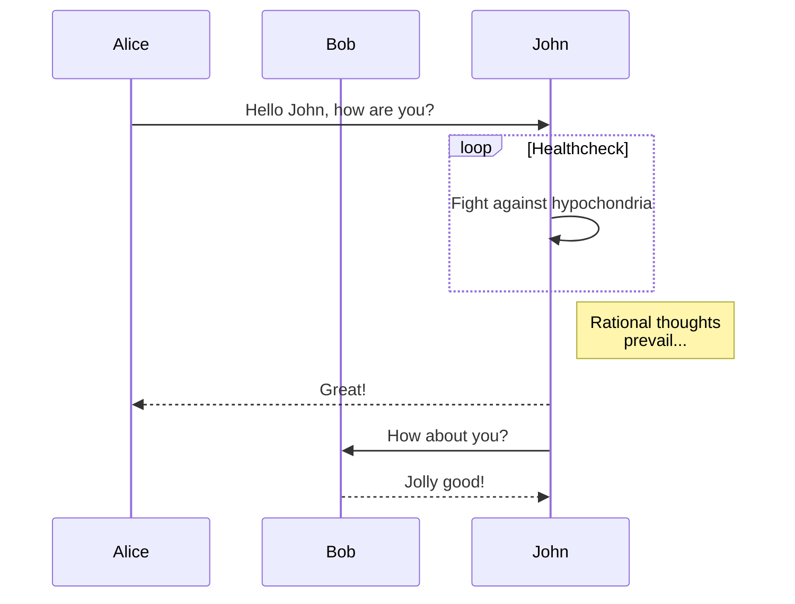

```mermaid
graph TB
    sq[Square shape] --> ci((Circle shape))

    subgraph A
        od>Odd shape]-- Two line<br/>edge comment --> ro
        di{Diamond with <br/> line break} -.-> ro(Rounded<br>square<br>shape)
        di==>ro2(Rounded square shape)
    end

    %% Notice that no text in shape are added here instead that is appended further down
    e --> od3>Really long text with linebreak<br>in an Odd shape]

    %% Comments after double percent signs
    e((Inner / circle<br>and some odd <br>special characters)) --> f(,.?!+-*ز)

    cyr[Cyrillic]-->cyr2((Circle shape Начало));

     classDef green fill:#9f6,stroke:#333,stroke-width:2px;
     classDef orange fill:#f96,stroke:#333,stroke-width:4px;
     class sq,e green
     class di orange
```

#🧰
🔗: [[Obsidian]]
🏷️: 
📅: [[2021-01-01]] 

# Mermaid Flowcharts Demo

```mermaid
```

---
```mermaid
pie title NETFLIX
         "Time spent looking for movie" : 80
         "Time spent watching it" : 20
```
---
---

---
---

---
---

---
---

---

sources:
 https://mermaid-js.github.io/mermaid/#/examples